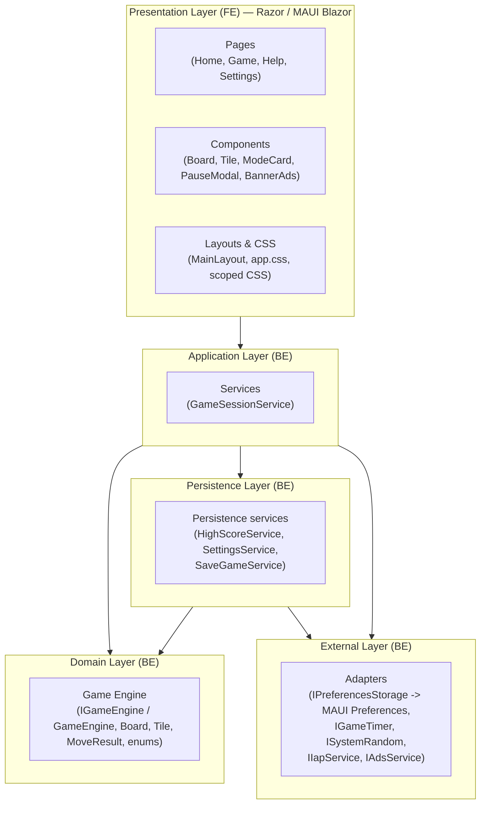
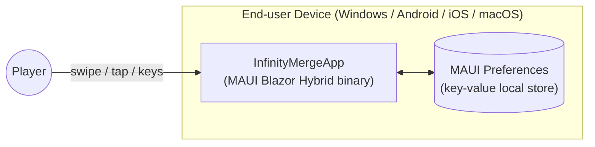
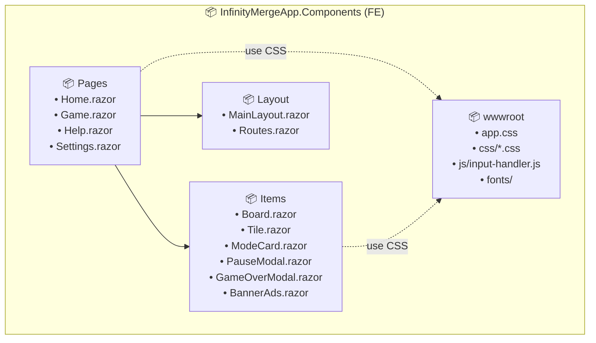
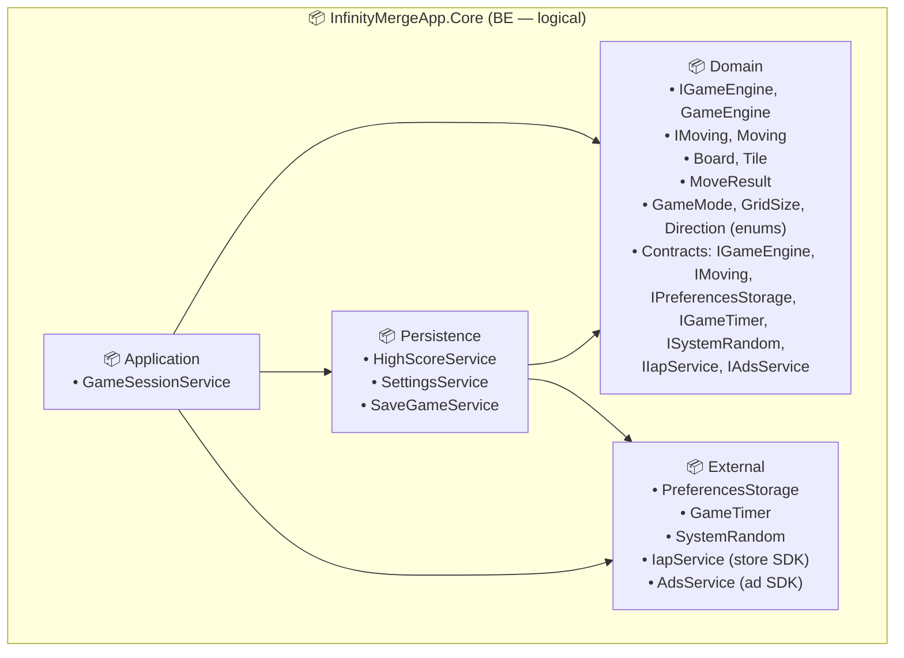
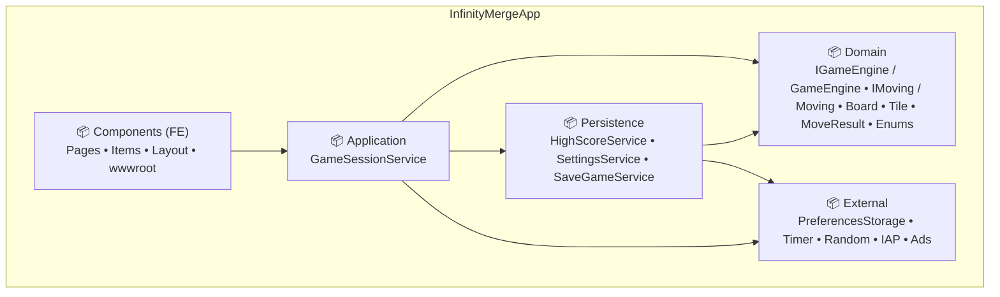
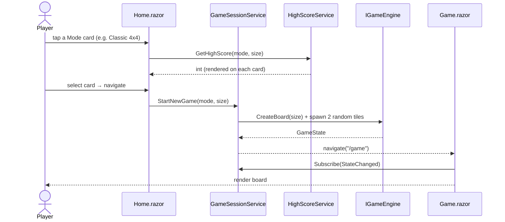
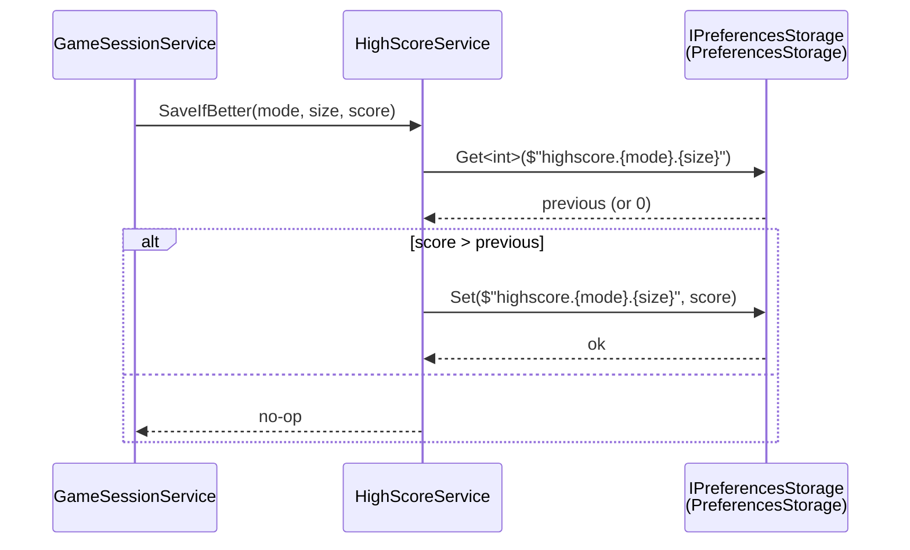

# Software Design Specification (SDS) — 2048 Infinity Merge

## Table of Contents

- [1. Introduction](#1-introduction)
- [2. Software Architecture](#2-software-architecture)
  - [2.1. Architectural Style](#21-architectural-style)
  - [2.2. High-Level Architecture Diagram](#22-high-level-architecture-diagram)
  - [2.3. Technology Stack](#23-technology-stack)
  - [2.4. Deployment View](#24-deployment-view)
- [3. Package Diagram](#3-package-diagram)
  - [3.1. Frontend (Presentation Layer)](#31-frontend-presentation-layer)
  - [3.2. Backend (Application, Domain, Persistence, External)](#32-backend-application-domain-persistence-external)
  - [3.3. Combined Package Diagram](#33-combined-package-diagram)
- [4. Data Design](#4-data-design)
  - [4.1. In-Memory Domain Model](#41-in-memory-domain-model)
    - [Domain entities (table)](#domain-entities-table)
    - [Domain enums](#domain-enums)
  - [4.2. Persistence (No Database)](#42-persistence-no-database)
- [5. Detailed Design](#5-detailed-design)
  - [5.1. Sequence — Start New Game (UC-01)](#51-sequence--start-new-game-uc-01)
  - [5.2. Sequence — Make Move (UC-02)](#52-sequence--make-move-uc-02)
  - [5.3. Activity — Slide & Merge Algorithm](#53-activity--slide--merge-algorithm)
  - [5.4. Sequence — Save High Score (Game Over)](#54-sequence--save-high-score-game-over)
- [6. Class Specification](#6-class-specification)
  - [6.1. `IGameEngine` & `GameEngine` (Domain)](#61-igameengine--gameengine-domain)
  - [6.1.1. `IMoving` & `Moving` (slide / merge)](#611-imoving--moving-slide--merge)
  - [6.2. `Board` (Domain)](#62-board-domain)
  - [6.3. `Tile` (Domain)](#63-tile-domain)
  - [6.4. `MoveResult` & `MergeInfo` (Domain)](#64-moveresult--mergeinfo-domain)
  - [6.5. `GameState` (Domain)](#65-gamestate-domain)
  - [6.6. `HighScoreKey` & domain enums](#66-highscorekey--domain-enums)
  - [6.7. `GameSessionService` (Application)](#67-gamesessionservice-application)
  - [6.8. `HighScoreService` (Persistence)](#68-highscoreservice-persistence)
  - [6.9. `SettingsService` (Persistence)](#69-settingsservice-persistence)
  - [6.10. `SaveGameService` (Persistence)](#610-savegameservice-persistence)
  - [6.11. Domain contracts and External implementations](#611-domain-contracts-and-external-implementations)
  - [6.12. `IGameTimer` & `GameTimer`](#612-igametimer--gametimer-domain-contract--implementation)
  - [6.13. `ISystemRandom`, `IIapService`, `IAdsService`](#613-isystemrandom-iiapservice-iadsservice-domain-contracts--external-implementations)
  - [6.14. UI Components (Presentation)](#614-ui-components-presentation)

---

## 1. Introduction

### 1.1. Purpose

This document describes the **internal software design** of the **2048 Infinity Merge** application: how the system is decomposed into layers, packages, and classes, and how the major use cases are implemented.

### 1.2. Scope

The design covers the entire application — there is **no separate backend service** in the current version (see §2.4). All gameplay logic and persistence run on the client device.

### 1.3. References

- `project_introduction.md` — overall project goals and gameplay description.
- `software_requirement.md` — Use Cases (UC-01…UC-05) and Business Rules (BR-01…BR-13) that this design implements.

---

## 2. Software Architecture

### 2.1. Architectural Style

The application follows a **layered (Clean-Architecture-inspired)** style, combined with a lightweight **MVVM-like** pattern inside the Razor UI:

| Layer | Responsibility | Depends on |
|-------|----------------|-----------|
| **Presentation** *(FE)* | Razor components, layouts, CSS, JS interop. Renders state and dispatches user actions. | Application |
| **Application** *(BE)* | Use-case orchestration and game flow (`GameSessionService`). Holds in-memory state and raises UI events. | Domain, Persistence, External |
| **Domain** *(BE)* | Pure game rules: `Board`, `Tile`, `IGameEngine` (`GameEngine`), `MoveResult`, enums (`GameMode`, `GridSize`, `Direction`). No I/O. | — |
| **Persistence** *(BE)* | Business persistence services/repositories for high score, settings, and save game state. Owns key schema and serialization. | Domain contracts, External adapters |
| **External** *(BE)* | Adapters to platform / third-party SDKs: persistence implementation, timer implementation, random implementation, IAP and ads providers. | Domain contracts |

> **Note on "FE" vs "BE":** because the app is a single MAUI Blazor Hybrid client (no network split), *FE* and *BE* in this document refer to **logical layers inside the same process**, not separate deployable services.

### 2.2. High-Level Architecture Diagram

### 2.3. Technology Stack

| Concern | Choice |
|---------|--------|
| Application framework | **.NET MAUI Blazor Hybrid** (.NET 10) |
| UI | **Razor** components, **CSS** (in `wwwroot/css/`), minimal **JavaScript** for input handling (touch swipe, key events) |
| State management | Plain C# services registered as **singletons / scoped** in MAUI `MauiProgram` DI container |
| Persistence | **`Microsoft.Maui.Storage.Preferences`** (key/value) — see §4.2 |
| Telemetry (dev only) | **.NET Aspire** (`AppHost` + `ServiceDefaults`) — OpenTelemetry instrumentation during local development; not shipped in release builds. |
| Target platforms | Windows, Android, iOS, macOS (Mac Catalyst) |

### 2.4. Deployment View

- The application is a **single self-contained binary** per platform.
- **No network calls**, **no server**, **no cloud sync**.
- The `AppHost` and `ServiceDefaults` projects are used **only at development time** for orchestration and telemetry; they are **not deployed** to end users.

---

## 3. Package Diagram

> The "FE / BE" split here is logical (see §2.1). All packages live under the same `InfinityMergeApp` assembly.

### 3.1. Frontend (Presentation Layer)

### 3.2. Backend (Application, Domain, Persistence, External)

### 3.3. Combined Package Diagram

---

## 4. Data Design

> The application **does not use a database** (no SQLite, no remote DB) in the current version. All data is either **transient (in-memory)** or persisted as **key-value pairs** in MAUI `Preferences`.

### 4.1. In-Memory Domain Model

> Transient structures held in RAM during an active session. They are **not** mapped to a database; only lightweight values are persisted via `Preferences` (§4.2).

#### Domain entities (table)

| Entity | Kind | Key Fields | Notes |
|--------|------|------------|-------|
| `Tile` | `record struct` | `Value : int`, `Id : Guid` | Value is always a power of 2 (BR-03). `Id` enables UI animation tracking across moves. |
| `Board` | `class` | `Size : int`, `Cells : Tile[,]?` | `Cells` may be **`null`** before init; inside the array, **`default(Tile)`** (`Value == 0`) acts as empty until spawn assigns values (see §6.2). |
| `MergeInfo` | `record` | `TileId : Guid`, `FromRow/Col`, `ToRow/Col : int`, `IsMerged : bool`, `ValueAfter : int` | One slide/merge step for UI animation; listed inside `MoveResult.Merges`. |
| `MoveResult` | `record` | `Moved : bool`, `Merges : IReadOnlyList<MergeInfo>?`, `Score : int`, `IsGameOver : bool` | Returned by `IGameEngine.Move(...)` (BR-07, BR-08). `Score` is the delta gained on this move. |
| `GameState` | `class` | `Board` (required), `Mode`, `Score`, `RemainingTime?`, `IsPaused` | Live state of the current session. `RemainingTime` is used only in Time Mode. |
| `HighScoreKey` | `record` | `Mode : GameMode`, `GridSize : GridSize` | Key for high-score lookup per (mode × grid size) — BR-10. |

#### Domain enums

Enums are **not** listed in the entity table above; they are shared primitive types used inside those entities and by `IGameEngine`.

**`GameMode`**

- `Classic` — standard endless play.
- `Time` — play against a countdown (`GameState.RemainingTime`).

**`GridSize`**

- `S4` = 4 (4×4 board)
- `S5` = 5 (5×5 board)
- `S6` = 6 (6×6 board)

**`Direction`**

- `Up`, `Down`, `Left`, `Right` — swipe / keyboard input for `IGameEngine.Move(board, direction)`.

### 4.2. Persistence (No Database)

All persistent data is stored via **`Microsoft.Maui.Storage.Preferences`** — a thin OS-backed key/value store (`NSUserDefaults` on iOS/macOS, `SharedPreferences` on Android, registry on Windows).

**Key schema:**

| Key | Value type | Description |
|-----|-----------|-------------|
| `highscore.classic.4` | `int` | High score for Classic 4x4. |
| `highscore.classic.5` | `int` | High score for Classic 5x5. |
| `highscore.classic.6` | `int` | High score for Classic 6x6. |
| `highscore.time.4` | `int` | High score for Time 4x4. |
| `highscore.time.5` | `int` | High score for Time 5x5. |
| `highscore.time.6` | `int` | High score for Time 6x6. |
| `settings.sound` | `bool` | Sound on/off. |
| `settings.theme` | `string` | Selected theme ID. |
| `settings.timeMode.duration` | `int` (seconds) | Default round duration for Time Mode. |
| `savegame.mode` | `string` | Last active game mode. |
| `savegame.size` | `int` | Last active grid size. |
| `savegame.score` | `int` | Last in-progress score. |
| `savegame.board` | `string` (JSON) | Serialized board cells for resume flow. |
| `savegame.remainingTime` | `int?` (seconds) | Remaining time for Time Mode resume. |

**Why no DB:**
- Total data footprint is < 1 KB and only key-value access pattern.
- `Preferences` is built into MAUI on every target platform — no extra dependency, no schema migration.
- If richer needs arise later (replays, achievements), the `IPreferencesStorage` implementation can be swapped (e.g., **SQLite** via `sqlite-net-pcl`) without touching Application use-cases or Domain rules.

---

## 5. Detailed Design

### 5.1. Sequence — Start New Game (UC-01)

### 5.2. Sequence — Make Move (UC-02)

### 5.3. Activity — Slide & Merge Algorithm

The same routine works for any of the 4 directions by **rotating** the board so the move direction always points "left", running a 1-D pass on each row, then rotating back.

### 5.4. Sequence — Save High Score (Game Over)

---

## 6. Class Specification

> Only the non-trivial classes are detailed below. Razor components have UI-only logic and are described by their `.razor` files; only their **public bindable properties** are listed.

### 6.1. `IGameEngine` & `GameEngine` (Domain)

**`IGameEngine`** (`Domain/Interfaces`) — Application and tests depend on this **port**; DI registers `GameEngine` as the default implementation.

| Member | Signature | Behaviour (current codebase) |
|--------|-----------|------------------------------|
| `CreateBoard` | `Board CreateBoard(GridSize size)` | Allocates `Board` with `Size = (int)size` and `Cells = new Tile[edgeLength, edgeLength]` (all cells initially `default(Tile)`). |
| `RollSpawnTileValue` | `int RollSpawnTileValue(ISystemRandom rng)` | Returns **2** if `rng.NextDouble(1.0) < SpawnTwoProbability`, else **4** (implementation uses **0.5** for **2** vs **4**). |
| `RandomSpawnTile` | `Board RandomSpawnTile(Board board, ISystemRandom rng)` | Counts cells with `Tile.Value == 0`, picks index `rng.Next(emptyCount)`, sets that cell to `new Tile(RollSpawnTileValue(rng), Guid.NewGuid())`. If grid is full, returns `board` unchanged. Requires `Cells` square `Size×Size`. |
| `Move` | `MoveResult Move(Board board, Direction direction)` | Delegates slide+merge to **`IMoving.TryApplyMove`** on the implementation. Mutates `board.Cells`; fills `Merges` / `Score`; `IsGameOver` = `!HasAnyValidMove(board)` after the move. |
| `HasAnyValidMove` | `bool HasAnyValidMove(Board board)` | **`true`** if cloning the board and calling **`IMoving.TryApplyMove`** in **any** `Direction` would change the grid. |

**`GameEngine`** (`Domain/Rules`) — `sealed class GameEngine : IGameEngine`

| Aspect | Detail |
|--------|--------|
| **Namespace** | `_2048_Infinity_Merge.Domain.Rules` |
| **Responsibility** | Implements **`IGameEngine`**: board creation, spawn, game-over probe; **slide/merge** delegated to **`IMoving`** (default **`Moving`**). **No I/O.** |
| **Construction** | `GameEngine(IMoving? moving = null)` — uses `new Moving()` when `moving` is omitted (tests may inject a fake). |
| **Constants / fields** | `private const double SpawnTwoProbability = 0.5`; `private readonly IMoving _moving`. |
| **Implements** | `IGameEngine`; BR-01 … BR-09 (target). |

### 6.1.1. `IMoving` & `Moving` (slide / merge)

Source: **`Domain/Interfaces/IMoving.cs`**, implementation **`Domain/Rules/Moving.cs`** (sealed). **`GameEngine`** implements **`IGameEngine`** and depends on **`IMoving`** only; default **`new Moving()`** in `GameEngine` ctor.

#### `IMoving` — contract overview

`IMoving` is the **Domain port** for classic **2048 slide + merge** on a square `Tile[,]`. Callers (typically `GameEngine`) own the grid and pass a scratch **`merges`** list plus a **`score`** accumulator. Implementations **mutate** `cells` in place and **append** to `merges`; they **add** to `score` only when two tiles **merge** (the merged face value — i.e. doubled value — is added once per merge pair).

| Convention | Detail |
|------------|--------|
| **Indexing** | `cells[row, col]` with **`row`**, **`col`** ∈ **`[0, n)`**; **`n`** is the edge length (must match both dimensions of `cells`). |
| **`merges`** | Caller-supplied list; methods **append** `MergeInfo` entries (slides and merges). Caller may **`Clear()`** before a move if a fresh trace is required. |
| **`score`** | **`ref int`**; increased by the **post-merge tile value** (`oldValue * 2`) for each merge performed in the scope of the call. |
| **Return value** | Line helpers return **`true`** iff that row/column’s tiles **changed** (value or `Tile.Id`). Aggregate helpers return **`true`** if **any** invoked line returned **`true`**. |

#### `IMoving` — method specifications

| Method | Signature | Specification |
|--------|-----------|---------------|
| `TryApplyMove` | `bool TryApplyMove(Tile[,] cells, int n, Direction direction, List<MergeInfo> merges, ref int score)` | Single **entry point** for one move direction. Selects the row/column sweep based on **`direction`**: **`Left`** → `ApplyAllRowsLeft`, **`Right`** → `ApplyAllRowsRight`, **`Up`** → `ApplyAllColsUp`, **`Down`** → `ApplyAllColsDown`. **`cells`** must be allocated **`n × n`**. Returns whether **any** cell on the board changed. Unknown enum values: reference implementation throws **`ArgumentOutOfRangeException`**. |
| `ApplyAllRowsLeft` | `bool ApplyAllRowsLeft(Tile[,] cells, int n, List<MergeInfo> merges, ref int score)` | For each row index **`r`** from **`0`** to **`n − 1`**, calls **`CompressRowLeft(cells, r, n, merges, ref score)`**. Returns **`true`** if **at least one** row reported a change (OR-combination of per-row results). |
| `ApplyAllRowsRight` | `bool ApplyAllRowsRight(Tile[,] cells, int n, List<MergeInfo> merges, ref int score)` | Same as **`ApplyAllRowsLeft`**, but uses **`CompressRowRight`** for every row (slide/merge toward the **high** column index). |
| `ApplyAllColsUp` | `bool ApplyAllColsUp(Tile[,] cells, int n, List<MergeInfo> merges, ref int score)` | For each column index **`c`** from **`0`** to **`n − 1`**, calls **`CompressColUp(cells, c, n, merges, ref score)`**. Returns **`true`** if any column changed. |
| `ApplyAllColsDown` | `bool ApplyAllColsDown(Tile[,] cells, int n, List<MergeInfo> merges, ref int score)` | Same as **`ApplyAllColsUp`**, but uses **`CompressColDown`** for every column (slide/merge toward **row `n − 1`** — the “down” wall). |
| `CompressRowLeft` | `bool CompressRowLeft(Tile[,] cells, int r, int n, List<MergeInfo> merges, ref int score)` | Operates on **one row** **`r`**. Scans columns **`0 … n−1`**, collects non-empty tiles in order. Applies **one leftward pass**: adjacent equal non-zero values merge into a single tile with **doubled** value and a **new** `Guid`; both source tiles get **`MergeInfo`** with **`IsMerged == true`**; **`score`** increases by that merged value. Non-merging tiles slide toward column **`0`**; a **`MergeInfo`** with **`IsMerged == false`** is emitted when a tile’s column index changes. Vacated cells become **`default(Tile)`** (`Value == 0`). Returns **`true`** if any **`cells[r, c]`** differs from the row snapshot taken at entry (value or **`Id`**). |
| `CompressRowRight` | `bool CompressRowRight(Tile[,] cells, int r, int n, List<MergeInfo> merges, ref int score)` | Same merge semantics as **`CompressRowLeft`**, but the line is collected **right to left** (`n−1` down to **`0`**) and packed toward column **`n − 1`**; trailing columns are cleared with **`default(Tile)`**. |
| `CompressColUp` | `bool CompressColUp(Tile[,] cells, int c, int n, List<MergeInfo> merges, ref int score)` | Operates on **one column** **`c`**. Scans rows **`0 … n−1`** top to bottom, collects non-empty tiles, then applies the same **2048** merge-and-pack rules along the column toward **row `0`**. **`MergeInfo`** uses fixed **`c`** for **`FromCol`/`ToCol`** and varying row indices for **`FromRow`/`ToRow`**. Returns **`true`** if that column changed. |
| `CompressColDown` | `bool CompressColDown(Tile[,] cells, int c, int n, List<MergeInfo> merges, ref int score)` | Same as **`CompressColUp`**, but collects tiles **bottom to top** and packs toward **row `n − 1`**; rows above the packed result are cleared with **`default(Tile)`**. |
| `IsCellEmpty` | `bool IsCellEmpty(Tile tile)` | Pure predicate: returns **`true`** iff **`tile.Value == 0`**. Used to skip empty cells when building a line and to align with board “empty cell” conventions elsewhere (spawn, full-grid checks). |

#### `Moving` — implementation notes

| Aspect | Detail |
|--------|--------|
| **Kind** | `sealed class Moving : IMoving` |
| **Merge rule** | Along each line, **only adjacent equal values** merge in one sweep; each tile merges **at most once** per line per move (classic 2048). |
| **`MergeInfo`** | `FromCol` / `FromRow` / `ToCol` / `ToRow` use grid indices; **`IsMerged`** is **`true`** when two tiles combine; **`ValueAfter`** is the face value after the step (doubled on merge). |

### 6.2. `Board` (Domain)

| Aspect | Detail |
|--------|--------|
| **Namespace** | `_2048_Infinity_Merge.Domain` |
| **Kind** | `class` |

| Member | Signature | Meaning |
|--------|-----------|---------|
| `Size` | `int Size { get; set; }` | Edge length of the square grid (e.g. **4**, **5**, **6** aligned with `GridSize`). |
| `Cells` | `Tile[,]? Cells { get; set; }` | Two-dimensional array of tiles. **`null`** if not allocated; when allocated, dimensions should match `Size × Size`. Empty cells are currently **`default(Tile)`** (`Value == 0`, **`Guid.Empty`**) unless the model later adopts nullable `Tile?` per cell. |

**Target helpers (design intent — not necessarily present in code yet):** indexer `Tile? this[int r, int c]`, `bool IsFull()`, `IEnumerable<(int r, int c)> EmptyCells()`, `Board Clone()` for immutable move pipeline and tests.

### 6.3. `Tile` (Domain)

| Aspect | Detail |
|--------|--------|
| **Namespace** | `_2048_Infinity_Merge.Domain` |
| **Kind** | `record struct Tile(int Value, Guid Id)` — positional record struct |

| Positional parameter | Type | Meaning |
|---------------------|------|---------|
| `Value` | `int` | Face value shown on the tile (powers of two in classic 2048: **2**, **4**, **8**, …). **`0`** with **`Guid.Empty`** may represent an empty cell until spawning assigns a real id/value. |
| `Id` | `Guid` | Stable identifier for **animation** and correlating **`MergeInfo`** entries across frames. |

### 6.4. `MoveResult` & `MergeInfo` (Domain)

#### `MoveResult`

| Aspect | Detail |
|--------|--------|
| **Namespace** | `_2048_Infinity_Merge.Domain.Models.Entities` |
| **Kind** | `record MoveResult(...)` |

| Positional parameter | Type | Meaning |
|---------------------|------|---------|
| `Moved` | `bool` | **`true`** iff the board changed after the move (tiles slid or merged). |
| `Merges` | `IReadOnlyList<MergeInfo>?` | Per-tile motion / merge telemetry for UI (**may be `null`** or empty when nothing moved). |
| `Score` | `int` | Score **delta** gained **this move** only. |
| `IsGameOver` | `bool` | **`true`** when no valid moves remain after this move (and spawn if applicable). |

#### `MergeInfo`

| Aspect | Detail |
|--------|--------|
| **Namespace** | `_2048_Infinity_Merge.Domain.Models.Entities` |
| **Kind** | `record MergeInfo(...)` |

| Positional parameter | Type | Meaning |
|---------------------|------|---------|
| `TileId` | `Guid` | Identity of the tile participating in this motion (matches `Tile.Id`). |
| `FromCol`, `FromRow` | `int` | Source grid column / row **before** the move. |
| `ToCol`, `ToRow` | `int` | Destination grid column / row **after** the move. |
| `IsMerged` | `bool` | **`true`** if this step ends in a **merge** with another tile (same-value combine). |
| `ValueAfter` | `int` | Tile face value **after** this motion (e.g. doubled value when merged). |

### 6.5. `GameState` (Domain)

| Aspect | Detail |
|--------|--------|
| **Namespace** | `_2048_Infinity_Merge.Domain` |
| **Kind** | `class` — live session snapshot owned by Application layer |

| Member | Signature | Meaning |
|--------|-----------|---------|
| `Board` | `required Board Board { get; set; }` | Current grid and tile layout. |
| `Mode` | `GameMode Mode { get; set; }` | Active ruleset (**Classic** vs **Time**). |
| `Score` | `int Score { get; set; }` | Running score for the active session. |
| `RemainingTime` | `TimeSpan? RemainingTime { get; set; }` | Countdown remaining in **Time Mode**; **`null`** when not applicable. |
| `IsPaused` | `bool IsPaused { get; set; }` | Session paused flag (timer must pause per BR-12 when integrated). |

### 6.6. `HighScoreKey` & domain enums

#### `HighScoreKey`

| Aspect | Detail |
|--------|--------|
| **Namespace** | `_2048_Infinity_Merge.Domain` |
| **Kind** | `record HighScoreKey(GameMode Mode, GridSize GridSize)` |

| Positional parameter | Type | Meaning |
|---------------------|------|---------|
| `Mode` | `GameMode` | Which game mode the high score row belongs to. |
| `GridSize` | `GridSize` | Board size dimension for that score row. |

#### `GridSize` (`enum`)

| Member | Underlying value | Meaning |
|--------|------------------|---------|
| `S4` | `4` | **4×4** board |
| `S5` | `5` | **5×5** board |
| `S6` | `6` | **6×6** board |

#### `Direction` (`enum`)

| Members | Meaning |
|---------|---------|
| `Up`, `Down`, `Left`, `Right` | Player swipe / key direction for `IGameEngine.Move`. |

#### `GameMode` (`enum`)

| Members | Meaning |
|---------|---------|
| `Classic` | Untimed classic mode |
| `Time` | Timed mode (uses `IGameTimer` + `RemainingTime`) |

### 6.7. `GameSessionService` (Application)

| Aspect | Detail |
|--------|--------|
| **Responsibility** | Owns the live `GameState`, drives the game loop, raises `StateChanged` for the UI. Coordinates `IGameEngine`, `IGameTimer`, `HighScoreService`. |
| **Lifetime** | Singleton (registered in `MauiProgram`). |
| **Implements** | UC-01, UC-02, UC-03 |

#### `GameSessionService` — member specifications

| Member | Signature | Specification |
|--------|-----------|---------------|
| `StateChanged` | `event Action StateChanged` | Raised when session state changes so Razor UI can re-bind (see §5.2). |
| `Current` | `GameState Current { get; }` | Live session snapshot (board, mode, score, timer fields). |
| `StartNewGame` | `void StartNewGame(GameMode mode, GridSize size)` | Initializes a new session via `IGameEngine` (board + spawns); resets pause/timer per mode (UC-01). |
| `Move` | `void Move(Direction direction)` | Applies one player move: calls `IGameEngine.Move`, spawn, score update, game-over and high-score flow (UC-02). |
| `Pause` | `void Pause()` | Pauses session and timer where applicable (UC-03, BR-12). |
| `Resume` | `void Resume()` | Resumes session and timer (UC-03). |
| `QuitToHome` | `void QuitToHome()` | Ends session, stops timer, navigates logic back to home shell. |

### 6.8. `HighScoreService` (Persistence)

| Aspect | Detail |
|--------|--------|
| **Responsibility** | Read & write high scores. |
| **Depends on** | `IPreferencesStorage` |
| **Implements** | BR-10 |

#### `HighScoreService` — method specifications

| Method | Signature | Specification |
|--------|-----------|---------------|
| `GetHighScore` | `int GetHighScore(GameMode mode, GridSize size)` | Returns the persisted high score for the given mode and grid size (keys per §4.2). |
| `SaveIfBetter` | `void SaveIfBetter(GameMode mode, GridSize size, int score)` | Writes the score only when it strictly exceeds the stored value (BR-10). |

### 6.9. `SettingsService` (Persistence)

| Aspect | Detail |
|--------|--------|
| **Responsibility** | Read & write user settings. |
| **Depends on** | `IPreferencesStorage` |
| **Implements** | UC-04 |

#### `SettingsService` — member specifications

| Member | Signature | Specification |
|--------|-----------|---------------|
| `SoundEnabled` | `bool SoundEnabled { get; set; }` | Backed by `IPreferencesStorage` key `settings.sound` (§4.2). |
| `Theme` | `string Theme { get; set; }` | Theme identifier; key `settings.theme`. |
| `TimeModeDuration` | `TimeSpan TimeModeDuration { get; set; }` | Default round length for Time Mode; persisted as seconds (`settings.timeMode.duration`). |
| `SettingsChanged` | `event Action SettingsChanged` | Raised after a setting write so UI can refresh. |

### 6.10. `SaveGameService` (Persistence)

| Aspect | Detail |
|--------|--------|
| **Responsibility** | Save and restore in-progress game state (board, mode, score, remaining time). |
| **Depends on** | `IPreferencesStorage` |
| **Notes** | Keeps resume-flow persistence outside Domain and Application orchestration. |

#### `SaveGameService` — method specifications

| Method | Signature | Specification |
|--------|-----------|---------------|
| `Save` | `void Save(GameState state)` | Serializes in-progress state to `IPreferencesStorage` keys in §4.2 (`savegame.*`). |
| `TryRestore` | `GameState? TryRestore()` | Returns a hydrated `GameState` if valid save data exists; otherwise **`null`**. |
| `Clear` | `void Clear()` | Removes save-game keys so the next session does not auto-resume stale data. |

### 6.11. Domain contracts and External implementations

This section explains how **ports** (interfaces in **Domain**) connect to **adapters** (concrete classes in **External**).

#### Why split contract vs implementation?

- **Domain** defines *what* the game needs from the outside world (read/write key-value storage, random numbers, timers, IAP/ads), without referencing MAUI or vendor SDKs.
- **External** provides *how* those needs are satisfied on each platform (e.g. `Preferences`, OS timers, ad SDKs).
- **Persistence** services (`HighScoreService`, `SettingsService`, `SaveGameService`) depend on **`IPreferencesStorage`** — they call the interface; `PreferencesStorage` supplies the real backing store.

Dependency direction: **Persistence → `IPreferencesStorage` (Domain)** and **External → `IPreferencesStorage` (implements)**. Domain does **not** reference External.

#### `IPreferencesStorage` (Domain contract)

`IPreferencesStorage` is the abstraction for **local key/value persistence** (high scores, settings, save-game payloads).

| Method | Signature | Specification |
|--------|-----------|---------------|
| `Get` | `T? Get<T>(string key)` | Reads a value for `key`. Returns **`null`** if the key has never been written or cannot be deserialized. **`T?` is the stored value**, not another storage object. |
| `Set` | `void Set<T>(string key, T value)` | Writes or overwrites the value for `key`. |
| `Remove` | `void Remove(string key)` | Deletes `key` if present. |

**External implementation (reference):**

| Class | Role |
|-------|------|
| `PreferencesStorage` | Implements `IPreferencesStorage` using **`Microsoft.Maui.Storage.Preferences`** (target). **`*.cs` may temporarily live under `Domain/Rules`** as a stub until the adapter is moved exclusively to **External** + DI wiring from **`Merge.App`**. |

**Who uses `IPreferencesStorage`:** Persistence layer services listed in §6.8–§6.10 inject `IPreferencesStorage`; they choose concrete keys and types (`int`, `bool`, `string`, serialized board JSON, etc.) as described in §4.2.

**Swap:** The implementation behind `IPreferencesStorage` may later change (e.g. SQLite) without changing Domain contracts or Application orchestration — only DI registration and the External adapter change.

#### Other Domain contracts (see following subsections)

| Contract (Domain) | Typical External implementation | Detailed spec |
|-------------------|----------------------------------|---------------|
| `IGameEngine` | `GameEngine` (sealed, Domain/Rules) | §6.1 |
| `IGameTimer` | `GameTimer` (reference impl in Domain/Rules; MAUI `DispatcherTimer` adapter optional) | §6.12 |
| `IMoving` | `Moving` (sealed, Domain/Rules) | §6.1.1 |
| `ISystemRandom`, `IIapService`, `IAdsService` | `SystemRandom`, store IAP adapter, ad-network adapter | §6.13 |

### 6.12. `IGameTimer` & `GameTimer` (Domain contract + implementation)

`IGameTimer` abstracts a **countdown** used in **Time Mode**. `GameSessionService` owns the timer instance: it starts when a timed session begins, and **game pause must pause the timer** as well (BR-12). The UI subscribes to ticks to refresh the visible countdown.

#### `IGameTimer` — member specifications

| Member | Signature | Specification |
|--------|-----------|---------------|
| `Start` | `void Start(TimeSpan duration)` | Starts (or **restarts**) the countdown from the given total duration. Any previous run is effectively replaced: remaining time becomes `duration`, periodic ticks resume according to the implementation (see `Tick`). Idempotent expectation: calling `Start` again resets the clock for a new round. |
| `Pause` | `void Pause()` | Freezes the countdown: **no further `Tick` events** until `Resume`. Internally the implementation stores **remaining time** so `Resume` continues where the player left off (does not jump forward). |
| `Resume` | `void Resume()` | Continues from the remaining time saved at `Pause`. If the timer was not paused or was stopped, behaviour is undefined unless documented by the adapter — reference impl should no-op or align with “only valid after Pause”. |
| `Stop` | `void Stop()` | Ends the countdown: unsubscribed semantics — **no more `Tick`**, **`Elapsed` must not fire** after stop unless `Start` is called again. Used when quitting to home, ending the session, or switching modes. |
| `Tick` | `event Action<TimeSpan>? Tick` | Raised on a **fixed cadence** while the timer is running and not paused (e.g. once per second). The argument is the **remaining time** until zero (`TimeSpan`), so the UI can bind directly without recomputing. Implementations should avoid flooding (reasonable minimum interval, aligned with UI refresh needs). |
| `Elapsed` | `event Action<TimeSpan>? Elapsed` | Raised **once** when remaining time reaches **zero** (typically with `TimeSpan.Zero` or equivalent). Signals Time Mode end from the timer’s perspective; `GameSessionService` then applies game-over or mode-specific rules. Must not repeat until after the next `Start`. |

#### `GameTimer` (`Domain/Rules` — reference implementation)

| Aspect | Detail |
|--------|--------|
| **Namespace** | `_2048_Infinity_Merge.Domain.Rules` |
| **Role** | Implements `IGameTimer` using **`System.Threading.Timer`** (thread-pool callbacks). Uses an internal **`DateTimeOffset` deadline** plus **`TimeSpan` tick period** (currently **1 second**) so remaining time stays accurate across pause/resume. |
| **Fields / state** | `_gate` (lock), `_tickPeriod`, `_timer`, `_deadline`, `_paused`, `_pausedRemaining`. |

##### `GameTimer` — method specifications (reference)

| Method | Kind | Specification |
|--------|------|---------------|
| `Start` | public | Matches **`IGameTimer.Start`**; arms deadline and timer. |
| `Pause` | public | Matches **`IGameTimer.Pause`**; freezes remaining time and stops ticks until `Resume`. |
| `Resume` | public | Matches **`IGameTimer.Resume`**; continues from `_pausedRemaining`. |
| `Stop` | public | Matches **`IGameTimer.Stop`**; tears down timer; no further **`Tick`** / **`Elapsed`** until next `Start`. |
| `ScheduleTimerLocked` | private | Schedules or reschedules the underlying **`System.Threading.Timer`** while holding `_gate`. |
| `OnTick` | private | Callback: computes remaining time, raises **`Tick`**, raises **`Elapsed`** at zero, disposes timer when finished. |
| `RemainingOrZero` | private | Returns non-negative remaining **`TimeSpan`** for events and UI logic. |
| `DisposeTimerLocked` | private | Disposes timer instance under lock (used on stop / elapsed). |

**Note:** UI layers consuming `Tick` / `Elapsed` may need to **marshal to the UI thread** when updating Razor bindings. An alternate adapter can reimplement `IGameTimer` with **`DispatcherTimer`** without changing Domain.

### 6.13. `ISystemRandom`, `IIapService`, `IAdsService` (Domain contracts + External implementations)

These interfaces are **business-facing ports**: Domain/Application describe *what* randomness and monetisation flows need; **External** supplies adapters (`SystemRandom`, store IAP, ad SDK wrappers). The tables below are the **intended contract** — keep signatures in sync when adding the corresponding `*.cs` files under `Domain/Interfaces`.

#### `ISystemRandom`

Used by **`IGameEngine.RandomSpawnTile`** / **`RollSpawnTileValue`** (and any future stochastic rule): choose among empty cells and implement **spawn weights** (currently **50%** tile **2**, **50%** tile **4** via `RollSpawnTileValue`).

| Method | Signature | Specification |
|--------|-----------|---------------|
| `NextDouble` | `double NextDouble(double maxExclusive)` | Contract parameter **`maxExclusive`** documents an upper bound for scaling; **`SystemRandom`** currently forwards **`Random.Shared.NextDouble()`** (**uniform in \[0, 1)**). Used for spawn probability thresholds (`RollSpawnTileValue` compares against `SpawnTwoProbability`). |
| `Next` | `int Next(int maxExclusive)` | Returns a pseudo-random **integer in \[0, maxExclusive)** (uniform via `Random.Shared.Next`). Used to pick **which empty cell** receives the new tile when there are multiple vacant indices. **`maxExclusive` must be positive**; callers pass `emptyCellCount`. Throws **`ArgumentOutOfRangeException`** if violated (in `SystemRandom`). |

#### `SystemRandom` (`Domain/Rules`)

| Aspect | Detail |
|--------|--------|
| **Namespace** | `_2048_Infinity_Merge.Domain.Rules` |

##### `SystemRandom` — method specifications

| Method | Signature | Specification |
|--------|-----------|---------------|
| `Next` | `int Next(int maxExclusive)` | Validates **`maxExclusive > 0`**, then delegates to **`Random.Shared.Next`** (**uniform in \[0, maxExclusive)**). Throws **`ArgumentOutOfRangeException`** if violated. |
| `NextDouble` | `double NextDouble(double maxExclusive)` | Validates argument then returns **`Random.Shared.NextDouble()`** (**uniform in \[0, 1)**); **`maxExclusive`** documents scaling intent for callers. |

#### `IIapService`

Owns **store-backed entitlement** for purchases defined in product scope (e.g. **Remove Ads**). Application/UI call these APIs; Domain stays unaware of Google Play / App Store types.

| Member | Signature | Specification |
|--------|-----------|---------------|
| `AdsRemoved` | `bool AdsRemoved { get; }` | **Cached entitlement flag**: `true` if the user has a valid **remove-ads** purchase (or equivalent product). Updated after successful purchase or after **`RestorePurchasesAsync`**. Persistence of raw receipts may live in External, but this property is what the rest of the app checks before showing ads. |
| `PurchaseRemoveAdsAsync` | `Task PurchaseRemoveAdsAsync(CancellationToken cancellationToken = default)` | Starts the **platform purchase UI** for the remove-ads product. Completes when the dialog flow finishes: implementation should surface success/failure via completion or documented exceptions; on success, sets entitlement so **`AdsRemoved`** becomes `true`. Does nothing redundant if already entitled (typical: fast-path success). |
| `RestorePurchasesAsync` | `Task RestorePurchasesAsync(CancellationToken cancellationToken = default)` | Asks the store to **re-send purchased SKUs** (fresh install, reinstall, new device). Updates **`AdsRemoved`** when a matching entitlement is found. |

**External implementation:** Store-specific adapter classes (e.g. wrapping billing APIs per platform), registered in DI composition root — **not** referenced by Domain.

#### `IAdsService`

Controls **when** and **how** ads appear (banner, interstitial, rewarded — whatever is in scope). Must respect **`IIapService.AdsRemoved`** and offline/safety policies inside the adapter.

| Member | Signature | Specification |
|--------|-----------|---------------|
| `ShouldShowAds` | `bool ShouldShowAds { get; }` | **`false`** when ads must not run — e.g. user purchased remove-ads, parental/policy gate, or SDK unavailable. UI (`BannerAds.razor`, etc.) and Application consult this before loading creatives. |
| `PrepareInterstitial` | `void PrepareInterstitial()` | **Warm up** ad inventory early (e.g. after game over is likely) so `ShowInterstitial` has creative ready; implementations may no-op if interstitials are out of scope. |
| `ShowInterstitial` | `void ShowInterstitial(Action? onDismissed = null)` | Shows a **full-screen interstitial** when ready; invokes **`onDismissed`** after the user closes the ad or if show fails/skipped (exact guarantees documented per adapter — typically fire once per logical show attempt). |
| `ShowRewardedVideoAsync` | `Task<bool> ShowRewardedVideoAsync(CancellationToken cancellationToken = default)` | Optional pattern for **rewarded** placement: returns **`true`** only if the user **fully watched** the video and the SDK grants reward; **`false`** if skipped, failed, or unavailable. Application maps result to in-game benefit if needed. |

**External implementation:** Ad-network SDK wrapper(s); keeps Domain free of vendor namespaces.

### 6.14. UI Components (Presentation)

| Component | Purpose | Key bindings |
|-----------|---------|--------------|
| `Home.razor` | Renders the 6 mode cards. | Reads `HighScoreService` for each card. |
| `ModeCard.razor` | One card on Home. | `[Parameter] GameMode Mode`, `[Parameter] GridSize Size`, `[Parameter] int HighScore`. |
| `Game.razor` | Hosts `Board`, score, timer (if Time Mode), Pause button. | Subscribes to `GameSessionService.StateChanged`. |
| `Board.razor` | Renders the grid of tiles + animations. | `[Parameter] Board Board`, `[Parameter] EventCallback<Direction> OnMove`. |
| `Tile.razor` | Renders one tile with color/value. | `[Parameter] Tile Tile`. |
| `PauseModal.razor` | Modal overlay shown when paused (UC-03). | `[Parameter] EventCallback OnResume`, `[Parameter] EventCallback OnQuit`. |
| `GameOverModal.razor` | Modal shown after Game Over. | `[Parameter] int FinalScore`, `[Parameter] int HighScore`, callbacks for *Play Again* / *Home*. |
| `Help.razor` | Static gameplay instructions (UC-05). | — |
| `Settings.razor` | Read & write settings (UC-04). | Two-way bound to `SettingsService`. |
| `BannerAds.razor` | Optional in-app banner (in-scope per project intro). | — |
