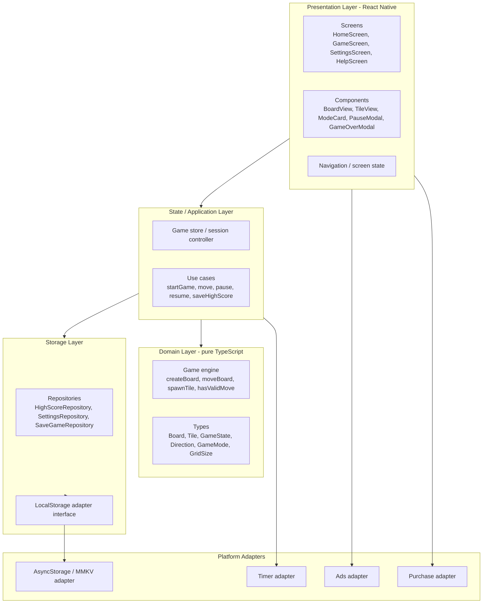
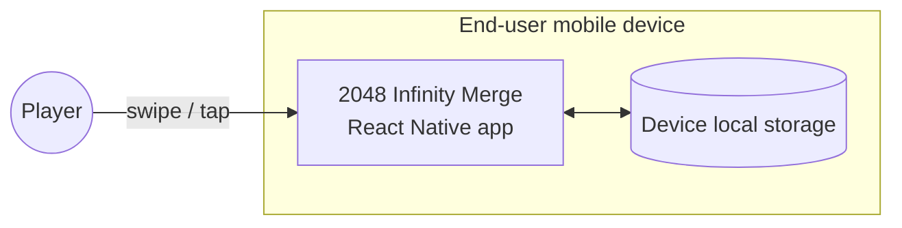
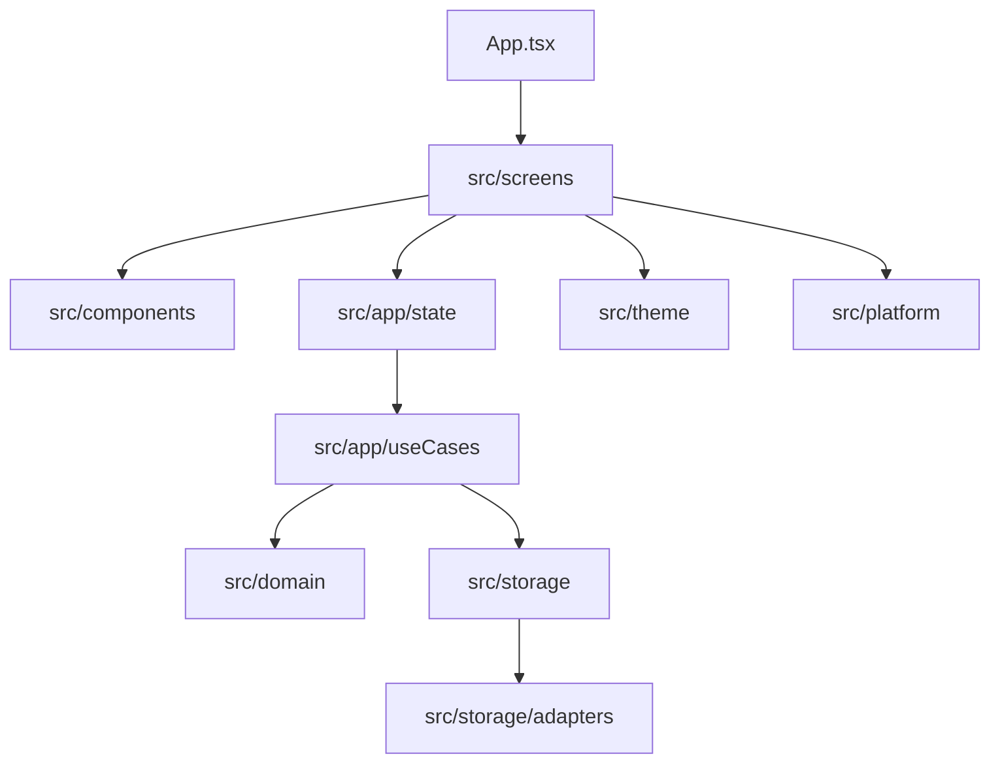
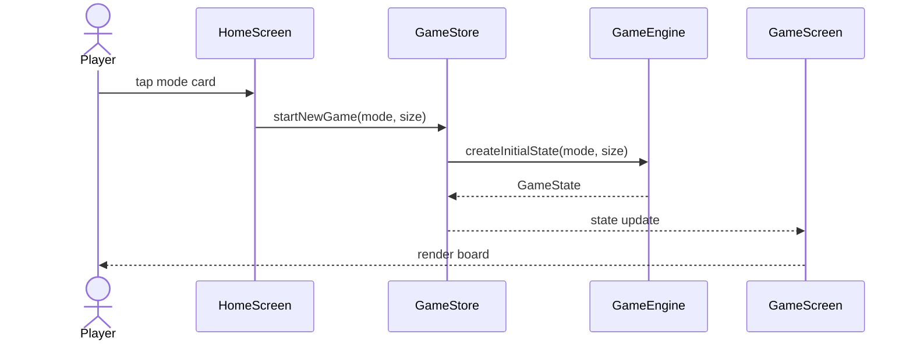
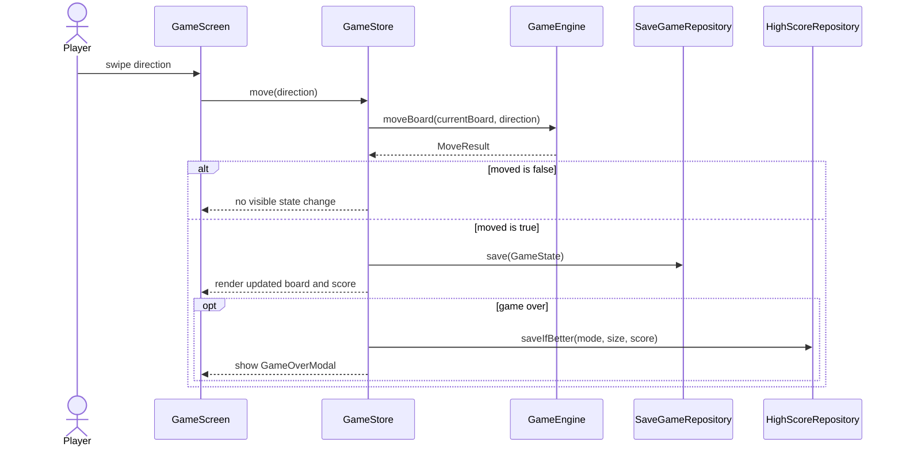
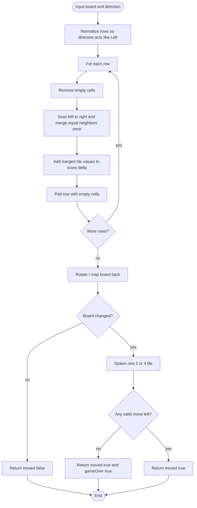

# Software Design Specification - 2048 Infinity Merge

## Table of Contents

- [1. Introduction](#1-introduction)
- [2. Software Architecture](#2-software-architecture)
  - [2.1. Architectural Style](#21-architectural-style)
  - [2.2. High-Level Architecture Diagram](#22-high-level-architecture-diagram)
  - [2.3. Technology Stack](#23-technology-stack)
  - [2.4. Deployment View](#24-deployment-view)
- [3. Package Design](#3-package-design)
- [4. Data Design](#4-data-design)
- [5. Detailed Design](#5-detailed-design)
- [6. Module Specification](#6-module-specification)
- [7. Current Project Notes](#7-current-project-notes)

---

## 1. Introduction

### 1.1. Purpose

This document describes the internal software design of **2048 Infinity Merge** after migrating the project direction to **React Native**. It explains how the mobile app should be decomposed into UI, state, game logic, storage, and platform-adapter modules.

### 1.2. Scope

The current version is a client-only mobile app. There is no backend service, no cloud sync, and no database server. Gameplay logic and persistence run on the user's Android or iOS device.

### 1.3. References

- `project_introduction.md` - project goals and gameplay description.
- `software_requirement.md` - use cases and business rules.
- `InfinityMerge2048/package.json` - current React Native project metadata.

---

## 2. Software Architecture

### 2.1. Architectural Style

The app follows a layered client architecture:

| Layer | Responsibility | Depends on |
|-------|----------------|------------|
| Presentation | React Native screens and components. Renders game state and captures touch input. | State / Application |
| State / Application | Owns current session state, orchestrates use cases, connects UI to game engine and storage. | Domain, Storage |
| Domain | Pure game rules: board, tile, move algorithm, scoring, game-over checks. No React Native or I/O imports. | None |
| Storage | Reads and writes high scores, settings, and save game payloads through an abstract local-storage adapter. | Domain types, Platform adapters |
| Platform adapters | React Native integrations such as local storage, timers, haptics, ads, purchases, and app lifecycle hooks. | React Native libraries |

The important boundary is that **Domain remains pure TypeScript**. It should be possible to test move and merge behavior with Jest without starting Metro, rendering React components, or loading a native module.

### 2.2. High-Level Architecture Diagram



### 2.3. Technology Stack

| Concern | Choice |
|---------|--------|
| Application framework | React Native |
| Language | TypeScript |
| Runtime UI | React components and React Native primitives |
| Styling | React Native `StyleSheet` and reusable style tokens |
| Safe areas | `react-native-safe-area-context` |
| State management | React state/hooks at first; Zustand, Redux Toolkit, or Context can be introduced only if app complexity requires it |
| Persistence | Local key/value adapter, implemented with AsyncStorage or MMKV |
| Testing | Jest, React Test Renderer, and optionally React Native Testing Library |
| Build targets | Android and iOS |
| Tooling | Metro, React Native CLI, Gradle, Xcode/CocoaPods |

### 2.4. Deployment View



- Android builds are produced through the React Native Android project and Gradle.
- iOS builds are produced through the React Native iOS project and Xcode/CocoaPods.
- The app is offline-first. Optional ads and purchases may use network access later, but game progress does not require a server.

---

## 3. Package Design

Recommended project structure:

```text
InfinityMerge2048/
  App.tsx
  index.js
  src/
    app/
      navigation/
      state/
      useCases/
    domain/
      engine/
      models/
      rules/
    storage/
      repositories/
      adapters/
    screens/
      HomeScreen.tsx
      GameScreen.tsx
      SettingsScreen.tsx
      HelpScreen.tsx
    components/
      BoardView.tsx
      TileView.tsx
      ModeCard.tsx
      PauseModal.tsx
      GameOverModal.tsx
    theme/
      colors.ts
      spacing.ts
      typography.ts
    platform/
      ads/
      purchases/
      haptics/
```

This structure is a design target. The current app may start smaller and split into these folders as implementation grows.



---

## 4. Data Design

### 4.1. Domain Models

| Model | TypeScript shape | Notes |
|-------|------------------|-------|
| `Tile` | `{ id: string; value: number }` | `value` is `2`, `4`, `8`, etc. `id` supports animation identity. |
| `Cell` | `Tile \| null` | `null` represents an empty board cell. |
| `Board` | `{ size: GridSize; cells: Cell[][] }` | Square matrix. `cells[row][col]`. |
| `GameState` | `{ board; mode; score; remainingTimeMs?; isPaused; status }` | Live session state. |
| `MoveResult` | `{ moved; board; scoreDelta; merges; isGameOver }` | Returned by the game engine after one move. |
| `MergeInfo` | `{ tileId; fromRow; fromCol; toRow; toCol; isMerged; valueAfter }` | Optional animation metadata. |
| `HighScoreKey` | `{ mode: GameMode; size: GridSize }` | Unique key for a score bucket. |

### 4.2. Enums and Literal Types

```ts
type Direction = 'up' | 'down' | 'left' | 'right';
type GameMode = 'classic' | 'time';
type GridSize = 4 | 5 | 6;
type GameStatus = 'idle' | 'playing' | 'paused' | 'gameOver';
```

### 4.3. Local Persistence

The current version does not need SQLite or a remote database. A key/value store is enough.

| Key | Value type | Description |
|-----|------------|-------------|
| `highscore.classic.4` | number | High score for Classic 4x4. |
| `highscore.classic.5` | number | High score for Classic 5x5. |
| `highscore.classic.6` | number | High score for Classic 6x6. |
| `highscore.time.4` | number | High score for Time 4x4. |
| `highscore.time.5` | number | High score for Time 5x5. |
| `highscore.time.6` | number | High score for Time 6x6. |
| `settings.sound` | boolean | Sound on/off. |
| `settings.haptics` | boolean | Haptics on/off. |
| `settings.theme` | string | Theme ID. |
| `settings.timeMode.durationMs` | number | Default Time Mode duration. |
| `savegame.state` | JSON string | Serialized `GameState` for resume flow. |

Storage access should go through a small interface:

```ts
interface LocalStorageAdapter {
  getString(key: string): Promise<string | null>;
  setString(key: string, value: string): Promise<void>;
  remove(key: string): Promise<void>;
}
```

Repositories can layer typed helpers on top of this adapter so UI and game logic do not manually parse storage payloads.

---

## 5. Detailed Design

### 5.1. Start New Game



### 5.2. Make Move



### 5.3. Slide and Merge Algorithm

The engine can normalize all moves into a "move left" operation:



### 5.4. Timer Behavior

- Time Mode stores `remainingTimeMs` in `GameState`.
- A timer adapter ticks at a UI-friendly cadence, typically once per second.
- Pause must stop countdown changes.
- Resume continues from the paused remaining time.
- When remaining time reaches zero, the session moves to Game Over and high score is saved if better.

---

## 6. Module Specification

### 6.1. `domain/engine`

| Function | Responsibility |
|----------|----------------|
| `createBoard(size)` | Create an empty square board. |
| `createInitialState(mode, size)` | Create a new session with 2 random starting tiles. |
| `moveBoard(board, direction)` | Apply slide/merge/spawn rules and return `MoveResult`. |
| `spawnRandomTile(board, rng)` | Place a `2` or `4` in a random empty cell. |
| `hasAnyValidMove(board)` | Return whether at least one move is possible. |
| `isPowerOfTwo(value)` | Validate tile values when restoring saved data. |

### 6.2. `app/state`

| Member | Responsibility |
|--------|----------------|
| `currentState` | Holds the active `GameState`. |
| `startNewGame(mode, size)` | Implements UC-01. |
| `move(direction)` | Implements UC-02. |
| `pause()` / `resume()` | Implements UC-03. |
| `quitToHome()` | Clears or abandons the active session. |
| `restoreSavedGame()` | Implements UC-06. |

### 6.3. `storage/repositories`

| Repository | Responsibility |
|------------|----------------|
| `HighScoreRepository` | Read and write scores by mode and grid size. |
| `SettingsRepository` | Read and write sound, haptics, theme, and Time Mode duration. |
| `SaveGameRepository` | Save, restore, validate, and clear serialized game state. |

### 6.4. `screens`

| Screen | Purpose |
|--------|---------|
| `HomeScreen` | Shows 6 mode cards and high scores. |
| `GameScreen` | Hosts board, score, timer, pause action, and touch input. |
| `SettingsScreen` | Lets the player change app settings. |
| `HelpScreen` | Shows how to play and explains modes. |

### 6.5. `components`

| Component | Purpose |
|-----------|---------|
| `BoardView` | Renders the tile grid. |
| `TileView` | Renders a single tile value and style. |
| `ModeCard` | Shows a mode/grid option and high score. |
| `PauseModal` | Offers Resume and Quit actions. |
| `GameOverModal` | Shows final score, high score, Play Again, and Home actions. |

---

## 7. Current Project Notes

- The active app folder is `InfinityMerge2048/`.
- The current entry file is `InfinityMerge2048/App.tsx`.
- The project currently uses React Native `0.86.0`, React `19.2.3`, TypeScript, Jest, Metro, Android, and iOS project folders.
- Existing .NET MAUI, Blazor, Razor, C#, AppHost, Aspire, and MAUI Preferences design references are deprecated and should not guide new implementation work.
- This document is a design target for the React Native version. It does not require immediate changes to production code.
