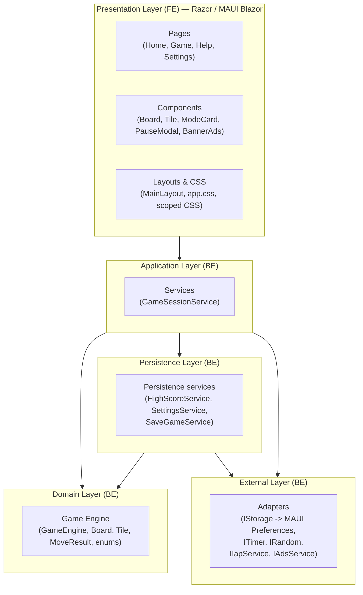
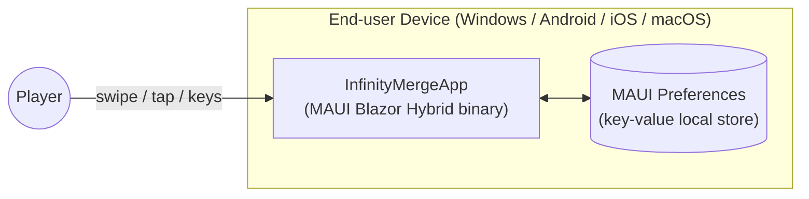
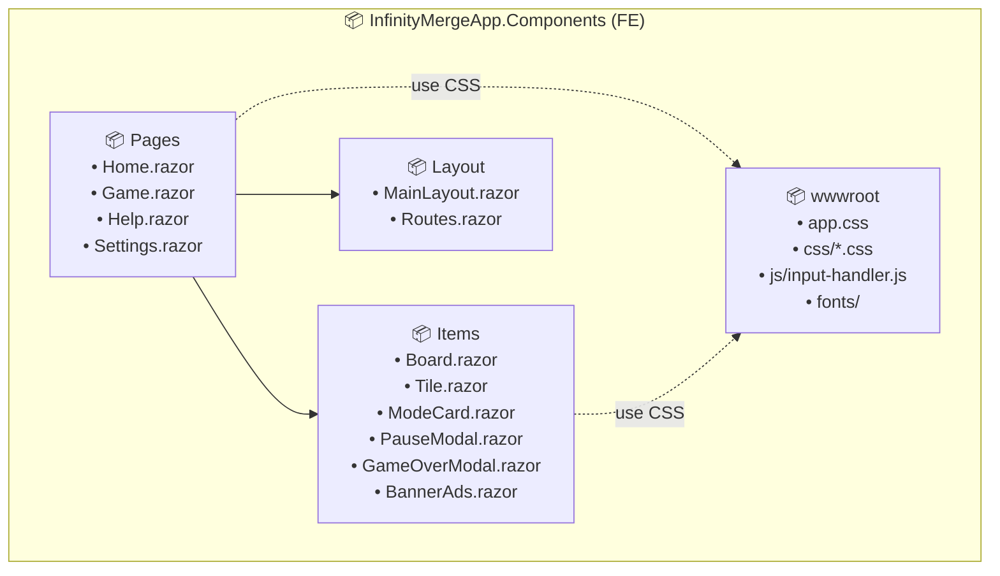
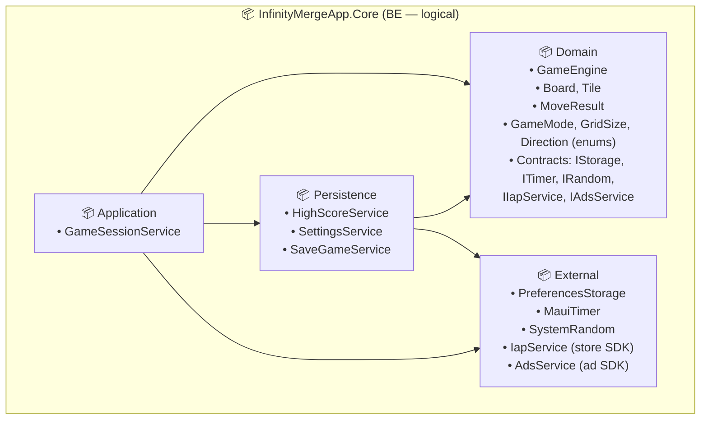
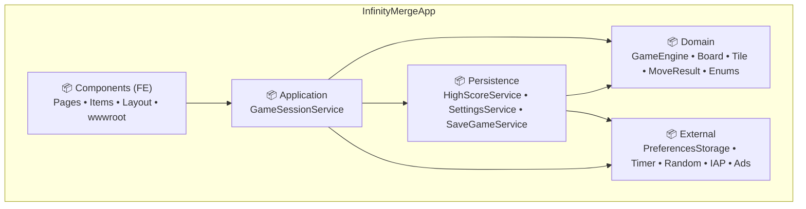
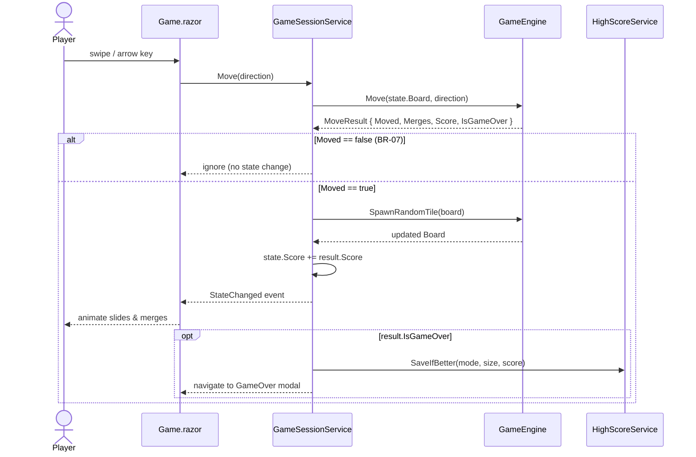
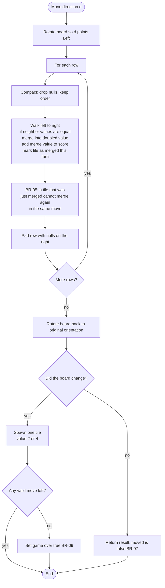
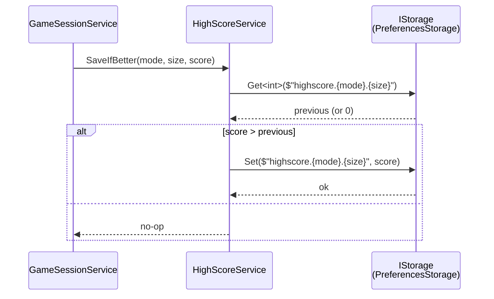

# Software Design Specification (SDS) — 2048 Infinity Merge

## Table of Contents

- [1. Introduction](#1-introduction)
- [2. Software Architecture](#2-software-architecture)
  - [2.1. Architectural Style](#21-architectural-style)
  - [2.2. High-Level Architecture Diagram](#22-high-level-architecture-diagram)
  - [2.3. Technology Stack](#23-technology-stack)
  - [2.4. Deployment View](#24-deployment-view)
- [3. Package Diagram](#3-package-diagram)
  - [3.1. Frontend (Presentation Layer)](#31-frontend-presentation-layer)
  - [3.2. Backend (Application, Domain, Persistence, External)](#32-backend-application-domain-persistence-external)
  - [3.3. Combined Package Diagram](#33-combined-package-diagram)
- [4. Data Design](#4-data-design)
  - [4.1. In-Memory Domain Model](#41-in-memory-domain-model)
    - [Domain entities (table)](#domain-entities-table)
    - [Domain enums](#domain-enums)
  - [4.2. Persistence (No Database)](#42-persistence-no-database)
- [5. Detailed Design](#5-detailed-design)
  - [5.1. Sequence — Start New Game (UC-01)](#51-sequence--start-new-game-uc-01)
  - [5.2. Sequence — Make Move (UC-02)](#52-sequence--make-move-uc-02)
  - [5.3. Activity — Slide & Merge Algorithm](#53-activity--slide--merge-algorithm)
  - [5.4. Sequence — Save High Score (Game Over)](#54-sequence--save-high-score-game-over)
- [6. Class Specification](#6-class-specification)

---

## 1. Introduction

### 1.1. Purpose

This document describes the **internal software design** of the **2048 Infinity Merge** application: how the system is decomposed into layers, packages, and classes, and how the major use cases are implemented.

### 1.2. Scope

The design covers the entire application — there is **no separate backend service** in the current version (see §2.4). All gameplay logic and persistence run on the client device.

### 1.3. References

- `project_introduction.md` — overall project goals and gameplay description.
- `software_requirement.md` — Use Cases (UC-01…UC-05) and Business Rules (BR-01…BR-13) that this design implements.

---

## 2. Software Architecture

### 2.1. Architectural Style

The application follows a **layered (Clean-Architecture-inspired)** style, combined with a lightweight **MVVM-like** pattern inside the Razor UI:

| Layer | Responsibility | Depends on |
|-------|----------------|-----------|
| **Presentation** *(FE)* | Razor components, layouts, CSS, JS interop. Renders state and dispatches user actions. | Application |
| **Application** *(BE)* | Use-case orchestration and game flow (`GameSessionService`). Holds in-memory state and raises UI events. | Domain, Persistence, External |
| **Domain** *(BE)* | Pure game rules: `Board`, `Tile`, `GameEngine`, `MoveResult`, enums (`GameMode`, `GridSize`, `Direction`). No I/O. | — |
| **Persistence** *(BE)* | Business persistence services/repositories for high score, settings, and save game state. Owns key schema and serialization. | Domain contracts, External adapters |
| **External** *(BE)* | Adapters to platform / third-party SDKs: persistence implementation, timer implementation, random implementation, IAP and ads providers. | Domain contracts |

> **Note on "FE" vs "BE":** because the app is a single MAUI Blazor Hybrid client (no network split), *FE* and *BE* in this document refer to **logical layers inside the same process**, not separate deployable services.

### 2.2. High-Level Architecture Diagram

### 2.3. Technology Stack

| Concern | Choice |
|---------|--------|
| Application framework | **.NET MAUI Blazor Hybrid** (.NET 10) |
| UI | **Razor** components, **CSS** (in `wwwroot/css/`), minimal **JavaScript** for input handling (touch swipe, key events) |
| State management | Plain C# services registered as **singletons / scoped** in MAUI `MauiProgram` DI container |
| Persistence | **`Microsoft.Maui.Storage.Preferences`** (key/value) — see §4.2 |
| Telemetry (dev only) | **.NET Aspire** (`AppHost` + `ServiceDefaults`) — OpenTelemetry instrumentation during local development; not shipped in release builds. |
| Target platforms | Windows, Android, iOS, macOS (Mac Catalyst) |

### 2.4. Deployment View

- The application is a **single self-contained binary** per platform.
- **No network calls**, **no server**, **no cloud sync**.
- The `AppHost` and `ServiceDefaults` projects are used **only at development time** for orchestration and telemetry; they are **not deployed** to end users.

---

## 3. Package Diagram

> The "FE / BE" split here is logical (see §2.1). All packages live under the same `InfinityMergeApp` assembly.

### 3.1. Frontend (Presentation Layer)

### 3.2. Backend (Application, Domain, Persistence, External)

### 3.3. Combined Package Diagram

---

## 4. Data Design

> The application **does not use a database** (no SQLite, no remote DB) in the current version. All data is either **transient (in-memory)** or persisted as **key-value pairs** in MAUI `Preferences`.

### 4.1. In-Memory Domain Model

> Transient structures held in RAM during an active session. They are **not** mapped to a database; only lightweight values are persisted via `Preferences` (§4.2).

#### Domain entities (table)

| Entity | Kind | Key Fields | Notes |
|--------|------|------------|-------|
| `Tile` | `record struct` | `Value : int`, `Id : Guid` | Value is always a power of 2 (BR-03). `Id` enables UI animation tracking across moves. |
| `Board` | `class` | `Size : int`, `Cells : Tile?[,]` | `null` cell = empty. |
| `MergeInfo` | `record` | `TileId : Guid`, `FromRow : int`, `FromCol : int`, `ToRow : int`, `ToCol : int`, `IsMerge : bool`, `ValueAfter : int` | One slide/merge step for UI animation; listed inside `MoveResult.Merges`. |
| `MoveResult` | `record` | `Moved : bool`, `Merges : IReadOnlyList<MergeInfo>`, `Score : int`, `IsGameOver : bool` | Returned by `GameEngine.Move(...)` (BR-07, BR-08). `Score` is the delta gained on this move. |
| `GameState` | `class` | `Board: Board`, `Mode : GameMode`, `Score : int`, `RemainingTime : TimeSpan?`, `IsPaused : bool` | Live state of the current session. `RemainingTime` is used only in Time Mode. |
| `HighScoreKey` | `record` | `Mode : GameMode`, `Size : GridSize` | Key for high-score lookup per (mode × grid size) — BR-10. |

#### Domain enums

Enums are **not** listed in the entity table above; they are shared primitive types used inside those entities and by `GameEngine`.

**`GameMode`**

- `Classic` — standard endless play.
- `Time` — play against a countdown (`GameState.RemainingTime`).

**`GridSize`**

- `S4` = 4 (4×4 board)
- `S5` = 5 (5×5 board)
- `S6` = 6 (6×6 board)

**`Direction`**

- `Up`, `Down`, `Left`, `Right` — swipe / keyboard input for `GameEngine.Move(board, direction)`.

### 4.2. Persistence (No Database)

All persistent data is stored via **`Microsoft.Maui.Storage.Preferences`** — a thin OS-backed key/value store (`NSUserDefaults` on iOS/macOS, `SharedPreferences` on Android, registry on Windows).

**Key schema:**

| Key | Value type | Description |
|-----|-----------|-------------|
| `highscore.classic.4` | `int` | High score for Classic 4x4. |
| `highscore.classic.5` | `int` | High score for Classic 5x5. |
| `highscore.classic.6` | `int` | High score for Classic 6x6. |
| `highscore.time.4` | `int` | High score for Time 4x4. |
| `highscore.time.5` | `int` | High score for Time 4x4. |
| `highscore.time.6` | `int` | High score for Time 6x6. |
| `settings.sound` | `bool` | Sound on/off. |
| `settings.theme` | `string` | Selected theme ID. |
| `settings.timeMode.duration` | `int` (seconds) | Default round duration for Time Mode. |
| `savegame.mode` | `string` | Last active game mode. |
| `savegame.size` | `int` | Last active grid size. |
| `savegame.score` | `int` | Last in-progress score. |
| `savegame.board` | `string` (JSON) | Serialized board cells for resume flow. |
| `savegame.remainingTime` | `int?` (seconds) | Remaining time for Time Mode resume. |

**Why no DB:**
- Total data footprint is < 1 KB and only key-value access pattern.
- `Preferences` is built into MAUI on every target platform — no extra dependency, no schema migration.
- If richer needs arise later (replays, achievements), the `IStorage` implementation can be swapped (e.g., **SQLite** via `sqlite-net-pcl`) without touching Application use-cases or Domain rules.

---

## 5. Detailed Design

### 5.1. Sequence — Start New Game (UC-01)

### 5.2. Sequence — Make Move (UC-02)

### 5.3. Activity — Slide & Merge Algorithm

The same routine works for any of the 4 directions by **rotating** the board so the move direction always points "left", running a 1-D pass on each row, then rotating back.

### 5.4. Sequence — Save High Score (Game Over)

---

## 6. Class Specification

> Only the non-trivial classes are detailed below. Razor components have UI-only logic and are described by their `.razor` files; only their **public bindable properties** are listed.

### 6.1. `GameEngine` (Domain)

| Aspect | Detail |
|--------|--------|
| **Responsibility** | Pure game rules: slide, merge, spawn, game-over detection. **No state, no I/O.** |
| **Public methods** | `Board CreateBoard(GridSize size)` `Board SpawnRandomTile(Board board, IRandom rng)` `MoveResult Move(Board board, Direction direction)` `bool HasAnyValidMove(Board board)` |
| **Implements** | BR-01, BR-02, BR-03, BR-04, BR-05, BR-06, BR-07, BR-08, BR-09 |
| **Notes** | Stateless and side-effect-free → trivially unit-testable. |

### 6.2. `Board` (Domain)

| Aspect | Detail |
|--------|--------|
| **Properties** | `int Size { get; }` `Tile?[,] Cells { get; }` |
| **Methods** | `Tile? this[int r, int c]` `bool IsFull()` `IEnumerable<(int r, int c)> EmptyCells()` `Board Clone()` |

### 6.3. `Tile` (Domain)

| Aspect | Detail |
|--------|--------|
| **Kind** | `record struct` |
| **Fields** | `int Value` (power of 2), `Guid Id` (animation tracking) |

### 6.4. `MoveResult` (Domain)

| Aspect | Detail |
|--------|--------|
| **Kind** | `record` |
| **Fields** | `bool Moved` `IReadOnlyList<MergeInfo> Merges` `int Score` (delta gained this move) `bool IsGameOver` |

### 6.5. `GameSessionService` (Application)

| Aspect | Detail |
|--------|--------|
| **Responsibility** | Owns the live `GameState`, drives the game loop, raises `StateChanged` for the UI. Coordinates `GameEngine`, `ITimer`, `HighScoreService`. |
| **Lifetime** | Singleton (registered in `MauiProgram`). |
| **Public API** | `event Action StateChanged` `GameState Current { get; }` `void StartNewGame(GameMode mode, GridSize size)` `void Move(Direction direction)` `void Pause()` / `void Resume()` `void QuitToHome()` |
| **Implements** | UC-01, UC-02, UC-03 |

### 6.6. `HighScoreService` (Persistence)

| Aspect | Detail |
|--------|--------|
| **Responsibility** | Read & write high scores. |
| **Public API** | `int GetHighScore(GameMode mode, GridSize size)` `void SaveIfBetter(GameMode mode, GridSize size, int score)` |
| **Depends on** | `IStorage` |
| **Implements** | BR-10 |

### 6.7. `SettingsService` (Persistence)

| Aspect | Detail |
|--------|--------|
| **Responsibility** | Read & write user settings. |
| **Public API** | `bool SoundEnabled { get; set; }` `string Theme { get; set; }` `TimeSpan TimeModeDuration { get; set; }` `event Action SettingsChanged` |
| **Depends on** | `IStorage` |
| **Implements** | UC-04 |

### 6.8. `SaveGameService` (Persistence)

| Aspect | Detail |
|--------|--------|
| **Responsibility** | Save and restore in-progress game state (board, mode, score, remaining time). |
| **Public API** | `void Save(GameState state)` `GameState? TryRestore()` `void Clear()` |
| **Depends on** | `IStorage` |
| **Notes** | Keeps resume-flow persistence outside Domain and Application orchestration. |

### 6.9. Domain contracts + External implementations

| Contract / Impl | Detail |
|--------|--------|
| **Domain contract** | `IStorage`: `T? Get<T>(string key)` `void Set<T>(string key, T value)` `void Remove(string key)` |
| **External implementation** | `PreferencesStorage` — wraps `Microsoft.Maui.Storage.Preferences`. |
| **Notes** | Business-facing interfaces stay in **Domain**; platform/SDK-specific code stays in **External**. |

### 6.10. `ITimer` & `MauiTimer` (Domain contract + External implementation)

| Aspect | Detail |
|--------|--------|
| **Interface** | `void Start(TimeSpan duration)` / `void Pause()` / `void Resume()` / `void Stop()` `event Action<TimeSpan> Tick` `event Action Elapsed` |
| **Used by** | `GameSessionService` for **Time Mode** countdown. Pausing the game also pauses the timer (BR-12). |

### 6.11. `IRandom`, `IIapService`, `IAdsService` (Domain contracts) + External implementations

| Aspect | Detail |
|--------|--------|
| **Contracts in Domain** | `IRandom`, `IIapService`, `IAdsService` are business-facing abstractions consumed by Application/Domain workflows. |
| **Implementations in External** | `SystemRandom`, store-specific IAP adapter, and ad-network adapter wrap platform or third-party SDKs. |
| **Notes** | Keeps Domain independent from infrastructure details and vendor SDKs. |

### 6.12. UI Components (Presentation)

| Component | Purpose | Key bindings |
|-----------|---------|--------------|
| `Home.razor` | Renders the 6 mode cards. | Reads `HighScoreService` for each card. |
| `ModeCard.razor` | One card on Home. | `[Parameter] GameMode Mode`, `[Parameter] GridSize Size`, `[Parameter] int HighScore`. |
| `Game.razor` | Hosts `Board`, score, timer (if Time Mode), Pause button. | Subscribes to `GameSessionService.StateChanged`. |
| `Board.razor` | Renders the grid of tiles + animations. | `[Parameter] Board Board`, `[Parameter] EventCallback<Direction> OnMove`. |
| `Tile.razor` | Renders one tile with color/value. | `[Parameter] Tile Tile`. |
| `PauseModal.razor` | Modal overlay shown when paused (UC-03). | `[Parameter] EventCallback OnResume`, `[Parameter] EventCallback OnQuit`. |
| `GameOverModal.razor` | Modal shown after Game Over. | `[Parameter] int FinalScore`, `[Parameter] int HighScore`, callbacks for *Play Again* / *Home*. |
| `Help.razor` | Static gameplay instructions (UC-05). | — |
| `Settings.razor` | Read & write settings (UC-04). | Two-way bound to `SettingsService`. |
| `BannerAds.razor` | Optional in-app banner (in-scope per project intro). | — |
