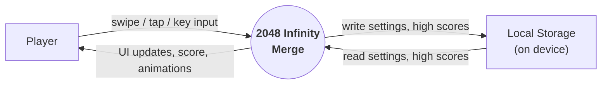
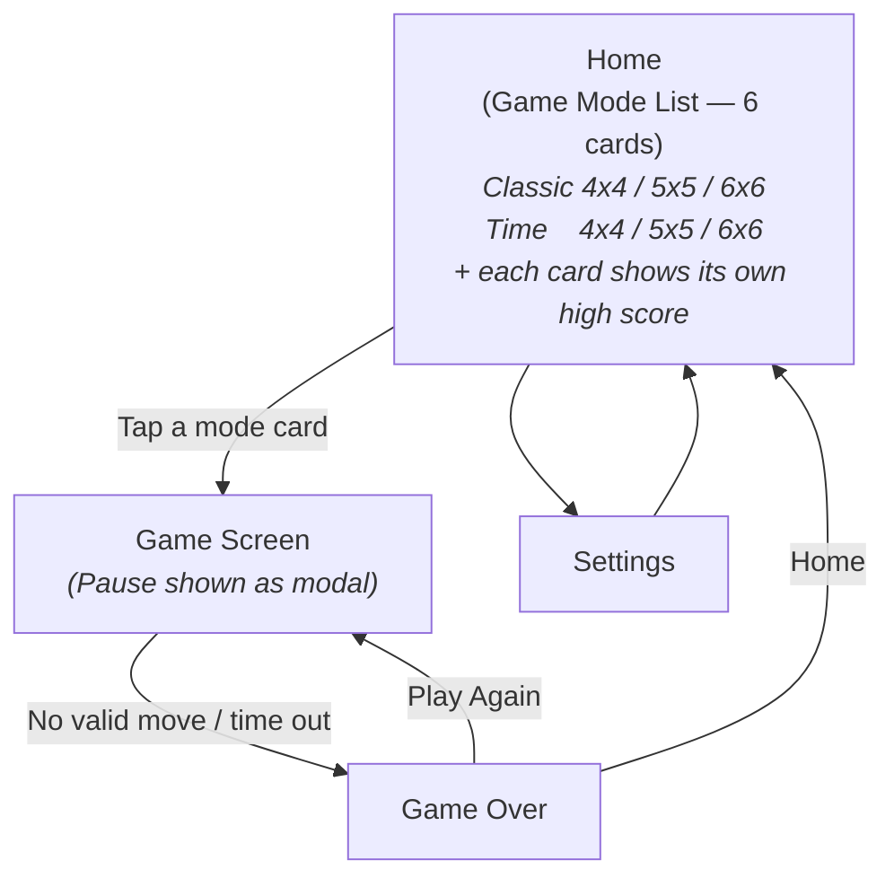
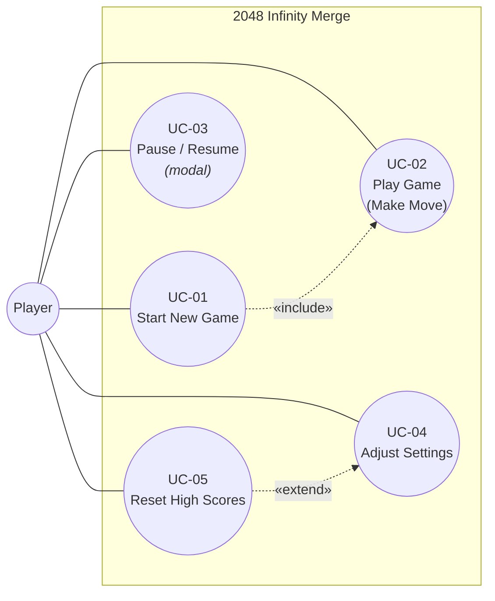

# Software Requirement — 2048 Infinity Merge

## Table of Contents

- [1. Context Diagram](#1-context-diagram)
- [2. Screen Flow](#2-screen-flow)
- [3. Use Case Diagram](#3-use-case-diagram)
- [4. Use Case Description](#4-use-case-description)
- [5. Business Rules](#5-business-rules)

---

## 1. Context Diagram

The system is a single-player offline puzzle game. It interacts with only one external actor (the **Player**) and one external resource (the device's **Local Storage**) for persisting settings and high scores.

> **Notation:** following the Yourdon / DeMarco convention — the **circle** in the center is the system (single process at context level), and the **rectangles** around it are external entities that interact with the system.

| # | Entity | Type | Description |
|---|--------|------|-------------|
| 1 | Player | External actor | The end user who plays the game. |
| 2 | 2048 Infinity Merge | System | The MAUI Blazor Hybrid application under development. |
| 3 | Local Storage | External resource | Device-local persistence for settings and high scores. |

---

## 2. Screen Flow

Main screens of the app and the navigation between them.

> **Notes:**
> - The Home screen **is** the game-mode list. There are **6 modes total**, one card per `(mode × grid size)` pair:
>   - **Classic 4x4**, **Classic 5x5**, **Classic 6x6**
>   - **Time 4x4**, **Time 5x5**, **Time 6x6**
> - There is **no separate "Grid Size Select" screen and no separate "Mode Select" screen** — both choices are unified into a single mode card on Home.
> - There is **no dedicated High Scores screen**. The high score for each mode is shown directly on its corresponding card on Home.
> - **Pause** is **not a separate screen** — it is rendered as a **modal overlay** on top of the Game screen.

---

## 3. Use Case Diagram

> **Note:** *Viewing* high scores is **not** a separate use case — every high score is shown inline on its corresponding mode card on the **Home** screen (one card per `mode × grid size` combination). *Resetting* them, however, is still a discrete action available from the Settings screen.

---

## 4. Use Case Description

### UC-01. Start New Game

| Field | Description |
|-------|-------------|
| **Actor** | Player |
| **Pre-condition** | The app is running and the Home screen is displayed. |
| **Main flow** | 1. System displays the Home screen with **6 mode cards**: *Classic 4x4 / 5x5 / 6x6* and *Time 4x4 / 5x5 / 6x6*. Each card shows the current high score of that mode. 2. Player taps one of the 6 mode cards. 3. System initializes a new board of the chosen grid size with 2 starting tiles, configures the rules of the chosen mode (untimed for Classic, countdown timer for Time), and navigates to the Game screen. |
| **Post-condition** | A new game session has started; UC-02 (Play Game) is active. |

### UC-02. Play Game (Make Move)

| Field | Description |
|-------|-------------|
| **Actor** | Player |
| **Pre-condition** | A game session is active and not paused. |
| **Main flow** | 1. Player performs a directional input (swipe / arrow key) — Up / Down / Left / Right. 2. System slides all tiles in that direction. 3. System merges any two adjacent tiles with the same value into a single doubled tile. 4. System updates the score. 5. System spawns one new tile (value `2` or `4`) at a random empty cell. 6. System checks for **Game Over** — if no valid move remains, transitions to the Game Over screen. |
| **Alt flow** | If the input would not change the board (no slide and no merge possible in that direction), the move is **ignored** — no new tile is spawned and no score is added. |
| **Post-condition** | The board state and score are updated; the game continues or ends. |

### UC-03. Pause / Resume

| Field | Description |
|-------|-------------|
| **Actor** | Player |
| **Pre-condition** | A game session is active. |
| **Main flow** | 1. Player taps the **Pause** button on the Game screen. 2. System suspends gameplay (in Time Mode, the timer is also paused) and overlays a **Pause modal** on top of the Game screen — the underlying board remains visible. 3. Player taps **Resume** to dismiss the modal and continue, or **Quit** to return to Home. |
| **Post-condition** | Gameplay continues from the same state, or the session is abandoned. |

### UC-04. Adjust Settings

| Field | Description |
|-------|-------------|
| **Actor** | Player |
| **Pre-condition** | The Settings screen is displayed. |
| **Main flow** | 1. Player changes a setting (e.g. sound on/off, theme, default time for Time Mode). 2. System validates and applies the change immediately. 3. System persists the new setting to local storage. |
| **Post-condition** | The new settings are active and persisted across app restarts. |

### UC-05. Reset High Scores

| Field | Description |
|-------|-------------|
| **Actor** | Player |
| **Pre-condition** | The Settings screen is displayed. |
| **Main flow** | 1. Player taps **Reset High Scores** on the Settings screen. 2. System asks for confirmation. 3. On confirmation, system clears all high score records (every `grid × mode` pair) in local storage. 4. Subsequent visits to the Mode Select screen will show empty / zero high scores. |
| **Post-condition** | All high scores are erased from local storage. |

---

## 5. Business Rules

| ID | Rule |
|----|------|
| **BR-01** | The board is a square grid of size `N x N` where `N ∈ {4, 5, 6}`. |
| **BR-02** | A new game starts with exactly **2 tiles** placed at random empty cells. |
| **BR-03** | Every tile value must be a **power of 2** (2, 4, 8, 16, …). New spawned tiles have value `2` or `4`. |
| **BR-04** | Two tiles can **merge** only if they have the **same value** and become adjacent during the same move; the result is one tile with value equal to the **sum** (i.e. doubled). |
| **BR-05** | Within a single move, **a tile can participate in at most one merge** (no chain merges in the same swipe). |
| **BR-06** | After every **valid** move, exactly **one** new tile (value `2` or `4`) is spawned at a random empty cell. |
| **BR-07** | A move is **invalid** (ignored) if it does not change the board — no slide and no merge happens. No new tile is spawned and no score is added. |
| **BR-08** | The score increases by the **value of the newly merged tile** for every merge that occurs in a move. |
| **BR-09** | **Game Over** occurs when the board is full **and** no two adjacent tiles share the same value (no possible merge in any direction). |
| **BR-10** | High scores are stored **per (game mode, grid size)** pair, independently. |
| **BR-11** | In **Time Mode**, the session ends when the timer reaches zero, even if valid moves remain. The final score at that moment is recorded. |
| **BR-12** | Pausing the game (UC-03) **also pauses the timer** in Time Mode. |
| **BR-13** | All persistent data (settings, high scores) is stored **only in local storage** on the device — no network or cloud sync in the current version. |
