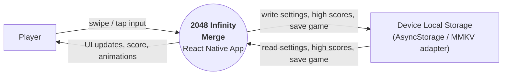
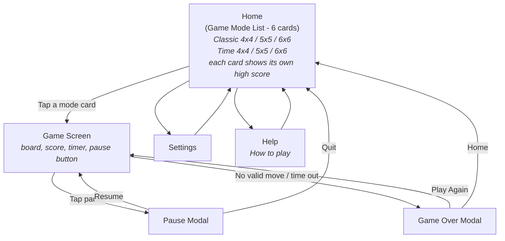
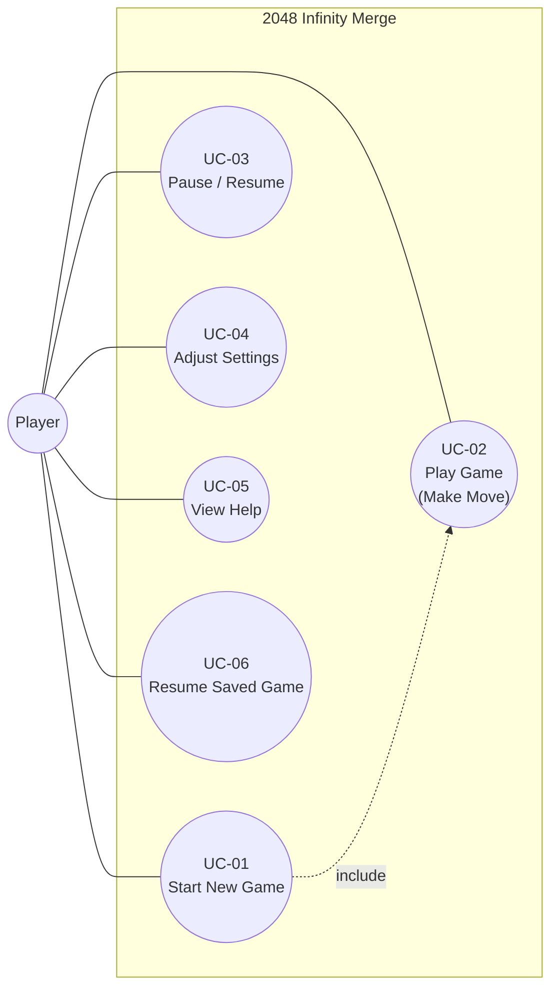

# Software Requirement - 2048 Infinity Merge

## Table of Contents

- [1. Context Diagram](#1-context-diagram)
- [2. Screen Flow](#2-screen-flow)
- [3. Use Case Diagram](#3-use-case-diagram)
- [4. Use Case Description](#4-use-case-description)
- [5. Business Rules](#5-business-rules)

---

## 1. Context Diagram

The system is a single-player offline mobile puzzle game. It interacts with the **Player** and with device-local storage for settings, save state, and high scores.

| # | Entity | Type | Description |
|---|--------|------|-------------|
| 1 | Player | External actor | The end user who plays the game on Android or iOS. |
| 2 | 2048 Infinity Merge | System | The React Native mobile application under development. |
| 3 | Device Local Storage | External resource | Device-local persistence for settings, high scores, and resumable game state. |

---

## 2. Screen Flow

Main screens of the app and the navigation between them.

Notes:

- The Home screen is the game-mode list. There are 6 mode cards: Classic 4x4, Classic 5x5, Classic 6x6, Time 4x4, Time 5x5, and Time 6x6.
- There is no separate grid-size selection screen in the current version.
- High scores are shown directly on their corresponding Home cards.
- Pause and Game Over are modal overlays, not full independent navigation roots.

---

## 3. Use Case Diagram

---

## 4. Use Case Description

### UC-01. Start New Game

| Field | Description |
|-------|-------------|
| Actor | Player |
| Pre-condition | The app is running and the Home screen is displayed. |
| Main flow | 1. System displays the Home screen with 6 mode cards. Each card shows the current high score for that mode and grid size. 2. Player taps one card. 3. System initializes a new board of the chosen grid size with 2 starting tiles. 4. System configures the mode rules: untimed for Classic, countdown for Time. 5. System navigates to or renders the Game screen. |
| Post-condition | A new game session has started. |

### UC-02. Play Game (Make Move)

| Field | Description |
|-------|-------------|
| Actor | Player |
| Pre-condition | A game session is active and not paused. |
| Main flow | 1. Player performs a directional swipe. 2. System slides all tiles in that direction. 3. System merges adjacent tiles with the same value. 4. System updates the score. 5. System spawns one new tile with value `2` or `4` at a random empty cell. 6. System checks for Game Over. 7. System persists the in-progress game state locally. |
| Alternative flow | If the input would not change the board, the move is ignored. No score is added, no tile is spawned, and no new save state is required. |
| Post-condition | The board state and score are updated, or the game ends. |

### UC-03. Pause / Resume

| Field | Description |
|-------|-------------|
| Actor | Player |
| Pre-condition | A game session is active. |
| Main flow | 1. Player taps the Pause button. 2. System freezes gameplay and pauses the timer in Time Mode. 3. System displays a Pause modal over the board. 4. Player taps Resume to continue or Quit to return Home. |
| Post-condition | Gameplay continues from the same state, or the session is abandoned. |

### UC-04. Adjust Settings

| Field | Description |
|-------|-------------|
| Actor | Player |
| Pre-condition | The Settings screen is displayed. |
| Main flow | 1. Player changes a setting such as sound, theme, haptics, or default Time Mode duration. 2. System applies the change immediately. 3. System persists the setting to device-local storage. |
| Post-condition | The new settings remain active across app restarts. |

### UC-05. View Help

| Field | Description |
|-------|-------------|
| Actor | Player |
| Pre-condition | The Home screen is displayed. |
| Main flow | 1. Player opens Help. 2. System displays gameplay instructions, scoring rules, and mode descriptions. 3. Player returns to Home. |
| Post-condition | The player has seen the instructions. |

### UC-06. Resume Saved Game

| Field | Description |
|-------|-------------|
| Actor | Player |
| Pre-condition | A valid saved game exists in local storage. |
| Main flow | 1. System detects saved game data on launch or Home render. 2. System offers a resume action or automatically restores according to product decision. 3. Player resumes the game. 4. System restores board, score, mode, grid size, and remaining time if applicable. |
| Post-condition | The previous session continues from the saved state. |

---

## 5. Business Rules

| ID | Rule |
|----|------|
| BR-01 | The board is a square grid of size `N x N` where `N` is one of `4`, `5`, or `6`. |
| BR-02 | A new game starts with exactly 2 tiles placed at random empty cells. |
| BR-03 | Every tile value must be a power of 2. New spawned tiles have value `2` or `4`. |
| BR-04 | Two tiles can merge only if they have the same value and become adjacent during the same move. |
| BR-05 | A tile can participate in at most one merge per move. |
| BR-06 | After every valid move, exactly one new tile is spawned at a random empty cell. |
| BR-07 | A move is invalid if it does not change the board. Invalid moves do not spawn tiles and do not add score. |
| BR-08 | The score increases by the value of each newly merged tile. |
| BR-09 | Game Over occurs when the board is full and no adjacent same-value pair remains. |
| BR-10 | High scores are stored independently per `(game mode, grid size)` pair. |
| BR-11 | In Time Mode, the session ends when the timer reaches zero, even if valid moves remain. |
| BR-12 | Pausing the game also pauses the timer in Time Mode. |
| BR-13 | Persistent data is stored only on the device in the current version. No server, cloud sync, or account system is required. |
| BR-14 | The app must respect mobile safe areas and remain playable on common Android and iOS screen sizes. |
